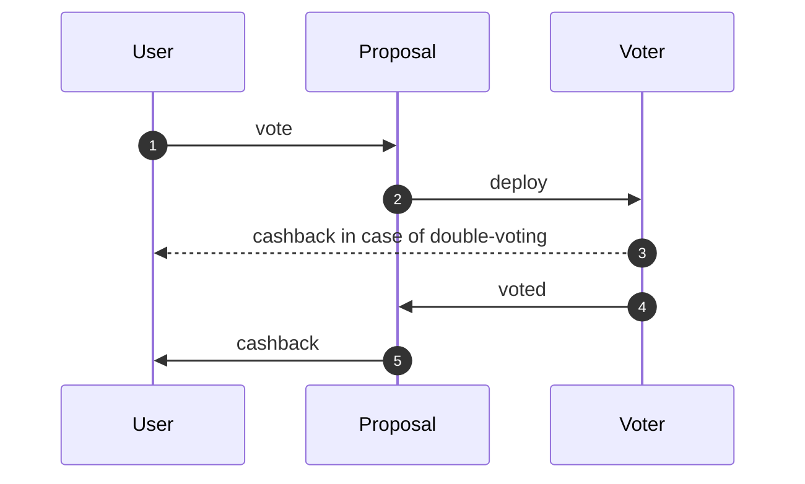

# Solution by Abionics (first place)

> [!IMPORTANT]  
> These are **NOT** my original submissions! The original ones were written in ASM (Fift) with
> a lot of low-level tricks, optimized for specific tests and omitted security checks
> 
> If you are interested in the original submission, check this:
> - **A** (124 points): [source code](https://gist.github.com/abionics/a6832efe0fb532a403d80853fdb87e85)
> - **C** (2054 points, max possible): [explanation](https://t.me/ton_smart_hub/1/4258)
> - **E**: same as C but with extra gas fee checks  
> - **B and D** are less interesting, so I omit them


## Explanation

In this code I try to keep a balance between readability and optimization.
That's why some optimizations are not included and covered in the [section bellow](#possible-optimizations)

### A

This is a basic solution with all necessary checks:
1) I keep the vote function as simple as possible
2) Move yes/no counting logic into getter (don't affect gas usage)
3) Local `sender` variable is used to save gas

### B

There are two key differences from A:
1) `ProposalMaster` contract that sends raw body (no op) and 
    `msg: Slice` in Proposal constructor to save gas
2) I used bitmap for storing votes. This allows me to save an empty cell inside
    a dict instead of `msg.value` bool. In FunC code it uses
    `__tact_dict_set_ref` instead of `dict_set_builder` that creates new builder

<details>
  <summary>See this difference in code</summary>

  `self.votes.set(sender, msg.value)` compiles into:
  ```c
     (cell, ()) __tact_dict_set_slice_int(cell d, int kl, slice k, int v, int vl) inline {
         if (null?(v)) {
             var (r, ok) = __tact_dict_delete(d, kl, k);
             return (r, ());
         } else {
             return (dict_set_builder(d, kl, k, begin_cell().store_int(v, vl)), ());
         }
     }
   ```

  While `self.voters.set(sender, emptyCell())` compiles into:
  ```c
     (cell, ()) __tact_dict_set_slice_cell(cell d, int kl, slice k, cell v) inline {
         if (null?(v)) {
             var (r, ok) = __tact_dict_delete(d, kl, k);
             return (r, ());
         } else {
             return __tact_dict_set_ref(d, kl, k, v);
         }
     }
   ```
</details>

### C

Here I used the bounce feature to handle double-voting in child contract:
1) This approach first counts votes and only then subtracts it in case of double-voting
2) This requires the user to send enough gas to cover the cost of the vote and the bounce,
    otherwise the vote can be counted twice. That's why vote has `0.02 ton` check

By the way, this is not a good idea for production code because in case of a huge TPS,
the bounce message can arrive much later and the contract will show an invalid score during all this time.
It is always better to do checks first and then count votes. See [E](#e) for this approach

### D

Nothing special, just [B](#b) with `nativeReserve` logic and `cashback`

### E

Unlike in C, here I do all checks first (in Voter) and then count votes.
It is done using the `receive(msg: Voted)` function that checks the sender and does all logic.
Here is a diagram of the process:



Also, I calculate the min amount of TON that a user must pass to pay all fees.
I estimated gas usage (around 10k) and used `computeDataSize` to calculate sizes for `getForwardFee`


## Possible Optimizations

1) Use lower error codes (2-63) in `throwIf` that will consume 26/76 gas instead of 34/84
2) Use asm function instead of `__tact_dict_set_slice_*` to directly set dict value
    because here I don't need the `__tact_dict_delete` part of it
3) Use `nativeSendMessage` and manually build the body
